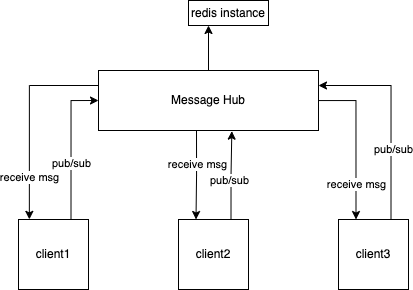

# mHub - simple message hub

---

### Convention


***Topic***: string 

***Message***: 

string with the following format `action.object_name.object_id`

`action`: can be any action ex.: `create`, `list`, `update`, `delete`, `sync`, etc.

`object_name`: is the object name or group of objects, ex: `mug` or `cat`

`object_id`: if action affects a particular object id, is the id of that object, otherwise if `null` or even nothing.

### Use Case




### Requirements

A running redis instance [check here how to start](https://redis.io/topics/quickstart)

### Quick Start

#### Server

```
go get -u github.com/jquiterio/mhub
go build github.com/jquiterio/mhub -o mhub
./mhub
```

this assume that you have a running REDIS SEVER on localhost:6379.

it will listen on port 8083 at localhost address.

#### Client

```go

import mhubClient "github.com/jquiterio/mhubclient-go"


func main() {
		// Create a Client
		srvAddr := "localhost:8083" 
		isSecure := false
  	cli, err := mhubClient.NewHubClient(srvAddr, isSecure)
	if err != nil {
		panic(err)
	}
	// Define what to do with Topic messages that you'll receive from http stream.
	cli.MessageHandler = func(msg interface{}) error {
		fmt.Println(msg) // in this case: just print them to stdout
		return nil
	}
	// Get the auto-generated Client ID. It's great for debug purpose
	// You can then use the ClientID in a variable $CLIENTID for debug purpose to post like:
	// curl -X POST -H "X-Subscriber-ID: $CLIENTID" \
	// http://localhost:8083/publish/test \
	// -d '{"msgType":"publish","topic":"test1","msg":"yay!"}'
	//fmt.Println(cli.ClientID)

	// Add a New Topic
	// This will add a Topic to the Client (local information)
	if ok := cli.AddTopic([]string{"test1", "test2"}); !ok {
		// do something if not OK
		// not that you'll not receive any messages if not declare topics here
		// like fmt.println("failed to add topics")
	}
	// Subscribe the client with topics you have added
	// This will subscribe cli.ClientID to topics 'test1' and 'test2'.
	if ok := cli.Subscribe(); !ok {
		panic("failed to subscribe")
	}
	// Client can also publish to hub, so other clients can get messages
	// This will publish to topic 'test1'
	cli.Publish("test1", "Yay!")
	// Me() is additional information you can get from Hub about this client.
	cli.Me()
	// This will retried a http stream messages to be parsed by cli.MessageHandler
	cli.GetMessages()
}
```

### Advanced Usage

#### Generate Certificates

if `cli, err := mhubClient.NewHubClient(srvAddr, true)` you have to create a tls certificate to use by the server and the client.

```bash
mkdir ~/mhub_certificates
cd ~/mhub_certificates

cp $GOPATH/src/github.com/jquiterio/mhub/gencert.sh .
./gencert.sh localhost
```

#### Start the message Hub Server

##### Option 1: Build and start

```bash
go build github.com/jquiterio/mhub -o mhub
./mhub #for default values
# OR
HUB_ADDR=localhost HUB_PORT=8083 REDIS_ADDR=localhost:6379 REDIS_PASSWD="" ./mhub
```

##### Option 2: Instantiate Hub Server in your project

```go
import "github.com/jquiterio/mhub/server"
func main(){
	hub := mhub.NewHub()
	// Possible actions/configurations:
	// hub.Subscribers = append(hub.Subscribers, mhub.Subscriber{ID: "FC27C37A-59C5-4913-976C-2CB6C55781A1", Topics: []string{"topic1", "topic2"}})
	// hub.Topics = append(hub.Topics, "topic1")
	// hub.Topics = append(hub.Topics, "topic2")
	// hub.Registry = redis.NewClient(&redis.Options{Addr: "localhost:6379", DB: 0})

	// work with mhub instance or Just start it
	// it will serve on port 8083
	// hub.Serve()

	// Possible Environment Variables for Hub:
	// HUB_ADDR: hostname or ip address
	// HUB_PORT: port number
	// HUB_SECURE: true or false // will configure tls and ./gencerts.sh can help to generate certificates
	// Note that, if HUB_SECURE is true, client must also be secure ex: cli.NewClient("localhost:8083", true)
}
```

##### Option 3: Docker

TBA
